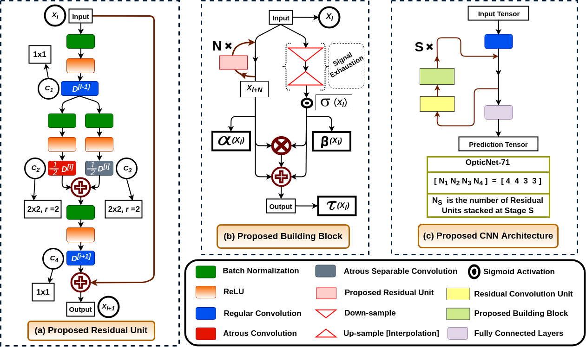

# ICMLA2019 OCT_Classification

[](https://paperswithcode.com/sota/retinal-oct-disease-classification-on-oct2017?p=optic-net-a-novel-convolutional-neural)
[](https://paperswithcode.com/sota/retinal-oct-disease-classification-on?p=optic-net-a-novel-convolutional-neural)

A model for classifying different Retinal Diseases using Deep Learning from Optical Coherence Tomography Images. This code is part of the **supplementary materials for the IEEE ICMLA 2019** for our paper *Optic-net: A Novel Convolutional Neural Network for Diagnosis of Retinal Diseases from Optical Tomography Images*. The paper has since been accpeted to IEEE ICMLA 2019 and will be preseneted in December 2019.



### IEEE Xplore Digital Library
```
https://ieeexplore.ieee.org/document/8999264
```

### Arxiv Pre-print
```
https://arxiv.org/abs/1910.05672
```

# Citation 
```
@inproceedings{kamran2019optic,
  title={Optic-Net: A Novel Convolutional Neural Network for Diagnosis of Retinal Diseases from Optical Tomography Images},
  author={Kamran, Sharif Amit and Saha, Sourajit and Sabbir, Ali Shihab and Tavakkoli, Alireza},
  booktitle={2019 18th IEEE International Conference On Machine Learning And Applications (ICMLA)},
  pages={964--971},
  year={2019}
  organization={IEEE}
}
```


## Pre-requisite
- Ubuntu 18.04 / Windows 7 or later
- NVIDIA Graphics card

## Installation Instruction for Ubuntu
- Download and Install [Nvidia Drivers](https://www.nvidia.com/Download/driverResults.aspx/142567/en-us)
- Download and Install via Runfile [Nvidia Cuda Toolkit 9.0](https://developer.nvidia.com/cuda-90-download-archive?target_os=Linux&target_arch=x86_64&target_distro=Ubuntu&target_version=1604&target_type=runfilelocal)
- Download and Install [Nvidia CuDNN 7.1 or later](https://developer.nvidia.com/rdp/cudnn-archive)
- Install Pip3 and Python3 enviornment
```
sudo apt-get install pip3 python3-dev
```
- Install Tensorflow-Gpu version-1.12 and Keras version-2.2.4
```
sudo pip3 install tensorflow-gpu==1.12.1
sudo pip3 install keras==2.2.4
```
- N.B. If you don't have GPU, you can also build Tensorflow-CPU
```
sudo pip3 install tensorflow==1.12.1
sudo pip3 install keras==2.2.4
```
- Install packages from requirements.txt
```
sudo pip3 -r requirements.txt
```
## Installation Instruction for Windows
- Download and Install [Nvidia Drivers](https://www.nvidia.com/download/driverResults.aspx/130631/en-us)
- Download and Install [Nvidia Cuda Toolkit 9.0](https://developer.nvidia.com/cuda-90-download-archive?target_os=Windows&target_arch=x86_64&target_version=7&target_type=exelocal)
- Download and Install [Nvidia CuDNN 7.1 or later](https://developer.nvidia.com/rdp/cudnn-archive)
- Install Pip and Python3 environemnt from [Web link](https://www.python.org/downloads/windows/)
- Install Tensorflow-Gpu version-1.12 and Keras version-2.2.4
```
sudo pip3 install tensorflow-gpu==1.12.1
sudo pip3 install keras==2.2.4
```
- N.B. If you don't have GPU, you can also build Tensorflow-CPU
```
sudo pip3 install tensorflow==1.12.1
sudo pip3 install keras==2.2.4
```
- Install packages from requirements.txt
```
sudo pip3 -r requirements.txt
```

## Demo
- Download the weight file for model trained on Kermany2018 [Link](https://drive.google.com/open?id=1hMcRr4DscTGCskVdy5s4ANIBJ6sZN4yz)
- Download the weight file for model trained on Srinivasan2014 [Link](https://drive.google.com/open?id=1hf-J8uzeDk6tn4AS2iMKfm1p4j18LbKn)
- Run the inference.py file with the below command
```
python3 inference.py --imgpath='location of the testing image(single file)' --weights='location to the .h5 file' --dataset='Srinivasan2014 or Kermany2018'
```

## Training on Kermany2018 Dataset

- Please cite the paper if you use their data
```
@article{kermany2018identifying,
  title={Identifying medical diagnoses and treatable diseases by image-based deep learning},
  author={Kermany, Daniel S and Goldbaum, Michael and Cai, Wenjia and Valentim, Carolina CS and Liang, Huiying and Baxter, Sally L and McKeown, Alex and Yang, Ge and Wu, Xiaokang and Yan, Fangbing and others},
  journal={Cell},
  volume={172},
  number={5},
  pages={1122--1131},
  year={2018},
  publisher={Elsevier}
}
```

### Dataset download link for Kermany2014
```
https://data.mendeley.com/datasets/rscbjbr9sj/3
```

- Folder structure for training given below. Please make sure it matches with your local repository.
```
├── data
|   ├──OCT2017
|       ├──train
|           ├──CNV
|           ├──DME
|           ├──DRUSEN
|           └──NORMAL
|       ├──test
|           ├──CNV
|           ├──DME
|           ├──DRUSEN
|           └──NORMAL
├── src
├── LICENSE
├── README.md
├── data_preprocess_sri2014.py
├── inference.py
├── requirements.txt
├── test.py
└── train.py
```
- Type this in terminal to run the train.py file
```
python3 train.py --dataset=Kermany2018 --datadir=data/OCT2017 --batch=4 --epoch=30 --logdir=optic-net-oct2017-log --snapshot_name=optic-net-oct2017
```
- There are different flags to choose from. Not all of them are mandatory

```
   '--dataset', type=str, required=True, help='Choosing between 2 OCT datasets', choices=['Srinivasan2014','Kermany2018']
   '--batch', type=int, default=8
   '--input_dim', type=int, default=224
   '--datadir', type=str, required=True, help='path/to/data_directory'
   '--epoch', type=int, default=30
   '--logdir', type=str
   '--weights', type=str,default=None, help='Resuming training from previous weights'
   '--snapshot_name',type=str, default=None, help='Name the saved snapshot'
```

## Training on Srinivasan2014 Dataset

- Please cite the paper if you use their data
```
@article{sri2014,
  title={Fully automated detection of diabetic macular edema and dry age-related macular degeneration from optical coherence tomography images},
  author={Srinivasan, Pratul P and Kim, Leo A and Mettu, Priyatham S and Cousins, Scott W and Comer, Grant M and Izatt, Joseph A and Farsiu, Sina},
  journal={Biomedical optics express},
  volume={5},
  number={10},
  pages={3568--3577},
  year={2014},
  publisher={Optical Society of America}
}
```
### Dataset download link for Srnivinasan2014
```
http://people.duke.edu/~sf59/Srinivasan_BOE_2014_dataset.htm
```

## Folder Structure Rearrangement

- The folder stucture for this dataset needs to be rearranged. We have provided a .py file to rearrange the structure and also, create the necessary directories and sub-directories. Please run the python file **data_preprocess_sri2014.py**. In cmd/terminal type the below command. **Run it as it is or tinker with it, if you wanna change the directory.**

```
python3 data_preprocess_sri2014.py
```

- The structure will look like this before the rearrangement.
```
|──2014_BOE_Srinivasan
|  ├──Publication_Dataset
|     ├──AMD1
|     ├──AMD2
|     ├──DME1
|     ├──DME2
|     .....
|     .....
|     └──NORMAL15
|         └──TIFFs
|             └──8bitTIFFs
├── src
├── LICENSE
├── README.md
├── data_preprocess_sri2014.py
├── inference.py
├── requirements.txt
├── test.py
└── train.py
```
- And it will look like this afterwards.
```
├── data
|   ├──Srinivasan2014
|       ├──Train
|           ├──AMD
|           ├──DME
|           └──NORMAL
|       ├──Test
|           ├──AMD
|           ├──DME
|           └──NORMAL
├── src
├── LICENSE
├── README.md
├── data_preprocess_sri2014.py
├── inference.py
├── requirements.txt
├── test.py
└── train.py
```


- Type this in terminal to run the train.py file
```
python3 train.py --dataset=Srinivasan2014 --datadir=data/Srinivasan2014 --batch=4 --epoch=30 --logdir=optic-net-sri2014-log --snapshot_name=optic-net-sri2014
```
- There are different flags to choose from. Not all of them are mandatory

```
   '--dataset', type=str, required=True, help='Choosing between 2 OCT datasets', choices=['Srinivasan2014','Kermany2018']
   '--batch', type=int, default=8
   '--input_dim', type=int, default=224
   '--datadir', type=str, required=True, help='path/to/data_directory'
   '--epoch', type=int, default=30
   '--logdir', type=str
   '--weights', type=str,default=None, help='Resuming training from previous weights'
   '--snapshot_name',type=str, default=None, help='Name the saved snapshot'
```
# License
The code is released under the MIT License, you can read the license file included in the repository for details.
